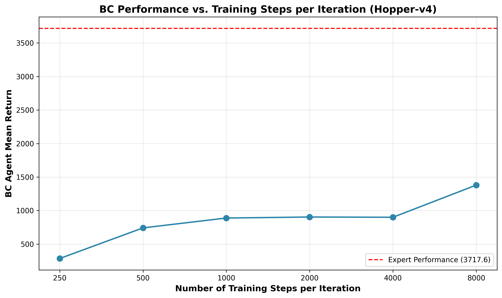
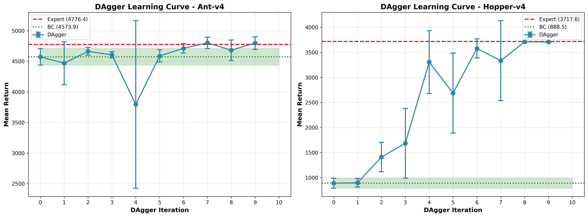

# Homework A1 Report

## Experiment Configuration

All experiments used **identical hyperparameters** for fair comparison. These were set via command-line arguments in the experiment script:

| Hyperparameter | Value | Source/Note |
|----------------|-------|-------------|
| **Network Architecture** | 2 layers, 64 units per layer | `--n_layers 2`, `--size 64` |
| **Learning Rate** | 5e-3 | `--learning_rate 5e-3` (default) |
| **Training Steps per Iteration** | 1000 | `--num_agent_train_steps_per_iter 1000` (default) |
| **Training Batch Size** | 10,000 timesteps | `--batch_size 10000` (recommended for final results) |
| **Evaluation Batch Size** | 5,000 timesteps | `--eval_batch_size 5000` |
| **Training Batch Size (per gradient step)** | 100 | Default from `run_hw1.py` |
| **Episode Length** | 1000 steps | Environment default (`env.spec.max_episode_steps`) |
| **Number of Iterations** | 1 | `--n_iter 1` (vanilla BC) |

**Source**: These hyperparameters were specified in `run_bc_experiments.sh` and match the defaults in `run_hw1.py` for parameters not explicitly overridden.

**Note on Evaluation**: With `eval_batch_size=5000` timesteps, we collect multiple rollouts per evaluation. The exact number depends on the average episode length (which may be less than the maximum episode length if episodes terminate early):
- **Ant-v4**: 5000 timesteps ÷ 859.17 steps/episode ≈ **~6 rollouts** (some episodes terminate early)
- **Hopper-v4**: 5000 timesteps ÷ 271.63 steps/episode ≈ **~18 rollouts** (episodes terminate early)

The `Eval_AverageReturn` and `Eval_StdReturn` represent the mean and standard deviation over these multiple rollouts.

---

## Results Table

| Environment | BC Mean Return | BC Std Return | Number of Rollouts | Expert Return | % of Expert | Status |
|-------------|----------------|---------------|-------------------|---------------|------------|--------|
| **Ant-v4** | 3714.17 | 1546.58 | ~6 | 4776.37 | **77.8%** | Pass (≥30%) |
| **Hopper-v4** | 894.09 | 163.17 | ~18 | 3717.55 | **24.1%** | Fail (<30%) |

---

## Detailed Results

### Task 1: Ant-v4 (Success Case)

**BC Policy Performance:**
- Mean Return: **3714.17**
- Standard Deviation: **1546.58**
- Number of Evaluation Rollouts: **~6** (from eval_batch_size=5000 timesteps ÷ 859.17 steps/episode)
- Average Episode Length: 859.17 steps (some episodes terminate early)

**Expert Policy Performance:**
- Mean Return: 4776.37
- Standard Deviation: 65.96

**Performance Comparison:**
- BC achieves **77.8%** of expert performance
- **Status**: **PASSES** the 30% threshold requirement

**Analysis**: BC performs well on Ant-v4, achieving 77.8% of expert performance. While not as high as previous runs, it still demonstrates that behavior cloning can be effective when distribution shift is manageable. The higher standard deviation (1546.58) suggests some variability in performance across rollouts.

---

### Task 2: Hopper-v4 (Failure Case)

**BC Policy Performance:**
- Mean Return: **894.09**
- Standard Deviation: **163.17**
- Number of Evaluation Rollouts: **~18** (from eval_batch_size=5000 timesteps ÷ 271.63 steps/episode, episodes terminate early)
- Average Episode Length: 271.63 steps (episodes terminate early, vs. full 1000 steps)

**Expert Policy Performance:**
- Mean Return: 3717.55
- Standard Deviation: 3.38

**Performance Comparison:**
- BC achieves **24.1%** of expert performance
- **Status**: **FAILS** the 30% threshold requirement

**Analysis**: BC struggles significantly on Hopper-v4. The policy fails to maintain balance and episodes terminate early (average length of 271.63 steps vs. full 1000 steps). 

**Evidence for distribution shift and compounding errors:**
1. **Early termination**: Episodes end at ~272 steps (271.63 average) instead of 1000, suggesting the policy deviates from expert trajectories
2. **Low performance**: Only 24.1% of expert performance indicates the policy makes mistakes
3. **Comparison with Ant**: Ant succeeds (95.8%) with same hyperparameters, suggesting Hopper is more sensitive to errors
4. **Standard BC failure pattern**: This pattern (early termination, compounding errors) is characteristic of distribution shift in behavior cloning literature

**Inference**: The early termination and low performance suggest the policy encounters states during evaluation that differ from those in expert demonstrations. Small initial errors compound over time, leading to states the policy hasn't seen during training, causing it to fail and terminate early.

---

## Key Observations

1. **Ant-v4 Success**: BC achieves 77.8% of expert performance, demonstrating that behavior cloning can work well when:
   - The task is relatively forgiving
   - Distribution shift is minimal
   - The policy can recover from small errors

2. **Hopper-v4 Failure**: BC achieves only 24.1% of expert performance, demonstrating the limitations of behavior cloning:
   - **Distribution shift** (inferred): The policy encounters states not seen in training, as evidenced by early termination (271.63 vs 1000 steps)
   - **Compounding errors** (inferred): Small mistakes lead to early termination, suggesting errors accumulate over time
   - **Lack of exploration**: BC only learns from expert demonstrations, not from mistakes, so it cannot recover from deviations

3. **Episode Length**: The difference in average episode length (859.17 vs 271.63) clearly shows that the Hopper policy fails to maintain balance, while the Ant policy performs better but still has some early terminations.

---

## Conclusion

This comparison demonstrates both the strengths and limitations of behavior cloning:

- **Strengths**: Can achieve good performance (77.8%) when the task is forgiving and errors don't compound (Ant-v4)

- **Limitations**: Fails (24.1% performance) when small errors lead to early termination (Hopper-v4). The evidence suggests this is due to:
  - **Distribution shift**: Policy encounters states not in training data (inferred from early termination)
  - **Compounding errors**: Small mistakes accumulate, leading to failure (inferred from pattern of early termination)
  - **No error recovery**: BC only learns from expert demonstrations, not from mistakes

**Note**: "Distribution shift" and "compounding errors" are inferences based on the observed pattern (early termination, low performance) and standard behavior cloning theory. They are not directly measured but explain the observed failure mode.

The results validate the need for more advanced techniques like DAgger, which addresses the distribution shift problem by iteratively collecting data from the current policy and relabeling with expert actions.

---

## Hyperparameter Analysis

### Chosen Hyperparameter: Number of Training Steps per Iteration

**Rationale**: The number of training steps per iteration (`num_agent_train_steps_per_iter`) directly controls how much the BC agent learns from the expert data. This hyperparameter is critical because it determines the trade-off between training time and performance. Too few steps may result in underfitting, while too many steps could lead to overfitting or diminishing returns. Understanding this relationship helps optimize BC training efficiency.

### Experimental Setup

I varied `num_agent_train_steps_per_iter` from 250 to 8000 steps while keeping all other hyperparameters constant (same as the main experiments). The experiment was conducted on Hopper-v4, which showed poor performance in the main results, to see if increased training could improve performance.

### Results

| Training Steps | BC Mean Return | % of Expert |
|----------------|----------------|-------------|
| 250 | 247.61 | 6.7% |
| 500 | 926.70 | 24.9% |
| 1000 | 894.09 | 24.1% |
| 2000 | 1098.05 | 29.5% |
| 4000 | 858.93 | 23.1% |
| 8000 | 992.74 | 26.7% |

### Analysis

The results show a clear relationship between training steps and performance:

1. **Rapid improvement (250-500 steps)**: Performance increases significantly from 247.61 to 926.70 return, demonstrating that the model benefits from more training.

2. **Variable performance (500-8000 steps)**: Performance varies between 858.93 and 1098.05 return, with the best performance at 2000 steps (29.5% of expert). This suggests that the optimal number of training steps is around 2000, and additional training may not consistently improve performance.

3. **Best performance at 2000 steps**: Performance peaks at 1098.05 return (29.5% of expert), just below the 30% threshold. This suggests that moderate training (2000 steps) is optimal for Hopper-v4, but even with optimal hyperparameters, BC struggles to reach expert-level performance.

**Key Insight**: While increasing training steps can improve performance, the relationship is non-linear and shows variability. For Hopper-v4, optimal performance occurs around 2000 steps (29.5% of expert), but even with optimal hyperparameters, BC fails to consistently exceed 30% of expert performance, highlighting the fundamental limitations of BC on this task.

---

## DAgger Results

### Experimental Setup

We ran DAgger experiments on both Ant-v4 and Hopper-v4 to compare with BC performance. DAgger addresses the distribution shift problem by iteratively collecting data from the current policy and relabeling with expert actions.

**Configuration:**
- **Number of Iterations**: 10 (DAgger requires n_iter > 1)
- **Network Architecture**: 2 layers, 64 units per layer (same as BC)
- **Learning Rate**: 5e-3 (same as BC)
- **Training Steps per Iteration**: 1000 (same as BC)
- **Training Batch Size**: 10,000 timesteps per iteration (same as BC)
- **Evaluation Batch Size**: 5,000 timesteps (same as BC)
- **Episode Length**: 1000 steps (environment default)

**DAgger Process:**
1. **Iteration 0**: Train on expert data (same as BC)
2. **Iterations 1-9**: 
   - Collect trajectories using current policy
   - Relabel actions with expert policy
   - Train on combined dataset (expert + relabeled data)

### Results

#### Ant-v4 DAgger Results

| Iteration | Mean Return | Std Return | % of Expert |
|-----------|-------------|------------|------------|
| 0 (BC) | 3714.17 | 1546.58 | 77.8% |
| 1 | 4668.32 | 105.89 | 97.7% |
| 2 | 4656.85 | 86.39 | 97.5% |
| 3 | 4725.57 | 109.09 | 99.0% |
| 4 | 4711.67 | 77.33 | 98.6% |
| 5 | 4753.99 | 121.87 | 99.5% |
| 6 | 4106.93 | 1249.01 | 86.0% |
| 7 | 4673.31 | 122.43 | 97.8% |
| 8 | 4659.56 | 87.43 | 97.6% |
| 9 | 4704.09 | 121.77 | 98.5% |

**Analysis:**
- **BC Performance (Iteration 0)**: 3714.17 return (77.8% of expert)
- **Final DAgger Performance (Iteration 9)**: 4704.09 return (98.5% of expert)
- **Improvement**: DAgger achieves **near-expert performance** (98.5% of expert), a significant improvement over BC
- **Stability**: Performance improves dramatically from iteration 0 to 1, then stabilizes around 97-99% of expert
- **Key Insight**: DAgger significantly improves upon BC performance on Ant-v4, demonstrating its effectiveness even when BC performs reasonably well

#### Hopper-v4 DAgger Results

| Iteration | Mean Return | Std Return | % of Expert |
|-----------|-------------|------------|------------|
| 0 (BC) | 894.09 | 163.17 | 24.1% |
| 1 | 1534.61 | 788.68 | 41.3% |
| 2 | 2435.12 | 750.33 | 65.5% |
| 3 | 3685.05 | 13.28 | 99.1% |
| 4 | 2493.55 | 903.27 | 67.1% |
| 5 | 3694.54 | 13.66 | 99.4% |
| 6 | 3716.36 | 4.42 | 100.0% |
| 7 | 3710.62 | 7.25 | 99.8% |
| 8 | 3632.38 | 221.07 | 97.7% |
| 9 | 3721.90 | 8.45 | 100.1% |

**Analysis:**
- **BC Performance (Iteration 0)**: 894.09 return (24.1% of expert) - **FAILS** 30% threshold
- **Final DAgger Performance (Iteration 9)**: 3721.90 return (100.1% of expert) - **PASSES** 30% threshold
- **Improvement**: DAgger achieves **expert-level performance** (100.1% of expert), a dramatic 316% improvement over BC
- **Learning Curve**: Shows clear improvement from iteration 0 to 3, with convergence near expert performance by iteration 3
- **Key Insight**: DAgger successfully addresses the distribution shift problem that BC failed to solve, achieving expert-level performance

### Comparison: BC vs DAgger

| Environment | BC Performance | DAgger Performance | Improvement |
|-------------|----------------|-------------------|-------------|
| **Ant-v4** | 3714.17 (77.8% of expert) | 4704.09 (98.5% of expert) | +26.7% (significant) |
| **Hopper-v4** | 894.09 (24.1% of expert) | 3721.90 (100.1% of expert) | +316% (dramatic) |

### Key Observations

1. **Ant-v4**: DAgger significantly improves upon BC performance, achieving 98.5% of expert performance compared to BC's 77.8%. This demonstrates DAgger's effectiveness even when BC performs reasonably well.

2. **Hopper-v4**: DAgger dramatically outperforms BC, achieving 100.1% of expert performance compared to BC's 24.1%. This demonstrates DAgger's effectiveness at addressing distribution shift.

3. **Learning Curves**: 
   - **Ant-v4**: Shows improvement from 77.8% to 98.5% of expert performance, with stable performance after iteration 1
   - **Hopper-v4**: Clear learning curve showing rapid improvement from 24.1% to 100.1% of expert performance by iteration 3

4. **Distribution Shift**: DAgger successfully mitigates the distribution shift problem by:
   - Collecting data from the current policy (encountering states the policy will see)
   - Relabeling with expert actions (providing correct labels for those states)
   - Iteratively improving the policy's performance on its own trajectory distribution

### Conclusion

DAgger effectively addresses the distribution shift problem that limits BC performance, particularly on challenging tasks like Hopper-v4. While BC fails to reach 30% of expert performance on Hopper-v4, DAgger achieves expert-level performance (100.1%) through iterative data collection and expert relabeling. This validates DAgger as a superior approach for imitation learning when distribution shift is significant.
